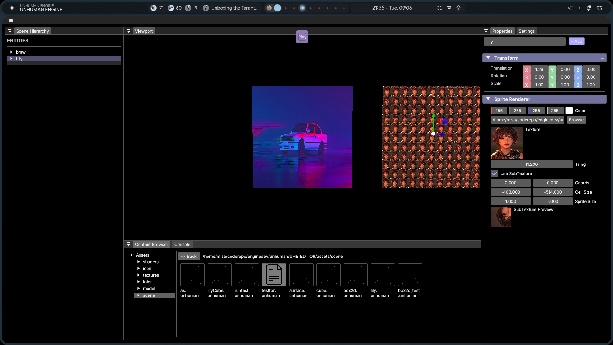

<div align="center">
  <h1>Unhuman Engine (UHE)</h1>
  <p>A modern, cross-platform C++ game engine powered by Vulkan and Slang.</p>
</div>

> [!WARNING]
> **Heavily Under Construction:** This engine is currently undergoing a massive architectural refactor (including a complete rewrite of the Vulkan RHI and cross-platform build systems). The codebase will be in a state of heavy flux for the next 2-3 months. Expect breaking changes and instability!

---

## Showcase

<div align="center">
  <!-- Place an image in the demo/ folder named 'editor_showcase.png' -->
  
  <br>
  <em>Unhuman Engine Editor Interface</em>
  <br><br>
  <!-- YouTube Demo Video -->
  <a href="https://youtu.be/CHDIU61auYo">
    
  </a>
  <br>
  <em>Real-time Rendering & Physics Demo</em>
</div>

---

**Unhuman Engine (UHE)** is a lightweight, highly extensible C++ game engine designed for real-time applications and game development. It utilizes a modern **Vulkan RHI** backend, compiles shaders via **Slang**, and features a fully integrated ImGui editor.

## Key Features

- **Modern Graphics Backend**: Fully abstracted Render Hardware Interface (RHI) running on **Vulkan**.
- **Slang Shader Compiler**: Next-generation shading language support with dynamic compilation and SPIR-V generation.
- **UHE Editor**: A robust, dockable ImGui-based editor (`UHE_EDITOR`) for scene inspection, profiling, and asset management.
- **Entity Component System**: A fast, data-driven scene system (`entt`) supporting native script components and serialization.
- **2D & 3D Physics**: Integrated physics handling with `Box2D and jolt(in future)`.
- **AAA Dependency Management**: No bloated submodules or slow package managers. The engine fetches precompiled binaries (Slang, GLFW) automatically for zero-compile-time dependencies.
- **Cross-Platform Tooling**: Generates Ninja builds for Linux and Visual Studio 2022 solutions for Windows with a single click.

## Recent Updates

- **Vulkan Refactor & AMD Stability**: Resolved texture dynamic indexing validation issues on AMD/RADV drivers by manually binding texture slots in Slang.
- **Color Accuracy & Aesthetics**: Restored pure black ImGui docking themes and fixed sRGB gamma-correction bugs that were washing out linear textures.
- **Improved UI Workflows**: Added full Drag-and-Drop payload support for textures directly into the 3D Viewport and Scene Hierarchy component inspectors.

## Architecture Overview

The repository is logically split to ensure the core engine remains separate from the application logic:

- `UHE/` — The core engine, platform abstraction (Windows/Linux), Vulkan RHI, and vendor libraries.
- `UHE_EDITOR/` — The standalone editor application built on top of the engine.
- `sandbox/` — A lightweight testing application for running isolated scenes.
- `script/Setup.py` — The automated dependency fetcher that pulls heavy OS-specific binaries (like Slang) into `UHE/vendor/bin/`.

## Getting Started

UHE uses a fully automated bootstrap system. You do not need to manually configure CMake or download binaries.

### Prerequisites
- A C++20 compatible compiler (GCC, Clang, or MSVC)
- CMake 3.16+
- Python 3 (Used for fetching precompiled binaries)
- Vulkan SDK

### Windows Installation
1. Clone the repository recursively (to fetch the lightweight submodules like `glm` and `spdlog`):
   ```cmd
   git clone --recursive https://github.com/rajaryan2007/unhuman.git
   cd unhuman
   ```
2. Run the generation script. This will download the Windows binaries for Slang and generate a `.sln` file:
   ```cmd
   GenerateProject.bat
   ```
3. Open `build/UHE.sln` in Visual Studio 2022 and hit **Build**.

### Linux Installation
1. Clone the repository recursively:
   ```bash
   git clone --recursive https://github.com/rajaryan2007/unhuman.git
   cd unhuman
   ```
2. Run the generation script. This will download the Linux binaries for Slang and generate `build.ninja`:
   ```bash
   ./GenerateProject.sh
   ```
3. Compile the engine using CMake:
   ```bash
   cmake --build build -j$(nproc)
   ```

*Note: The built executables (`UHE_EDITOR`, `Sandbox`) will be placed in the `bin/` directory.*

## Contributing

Contributions are always welcome! If you want to contribute to the engine:
1. Ensure your code complies with the project's `.clang-format` and `.clang-tidy` rules. (If using Neovim/VS Code with `clangd`, this will be automatic).
2. Avoid adding heavy binaries directly to the repository. If you need a new dependency (like Assimp), add its download URL to the `DEPENDENCIES` dictionary in `script/Setup.py`.

## 📄 License

Unhuman Engine is licensed under the **MIT License**. See the [LICENSE](LICENSE) file for more details.
